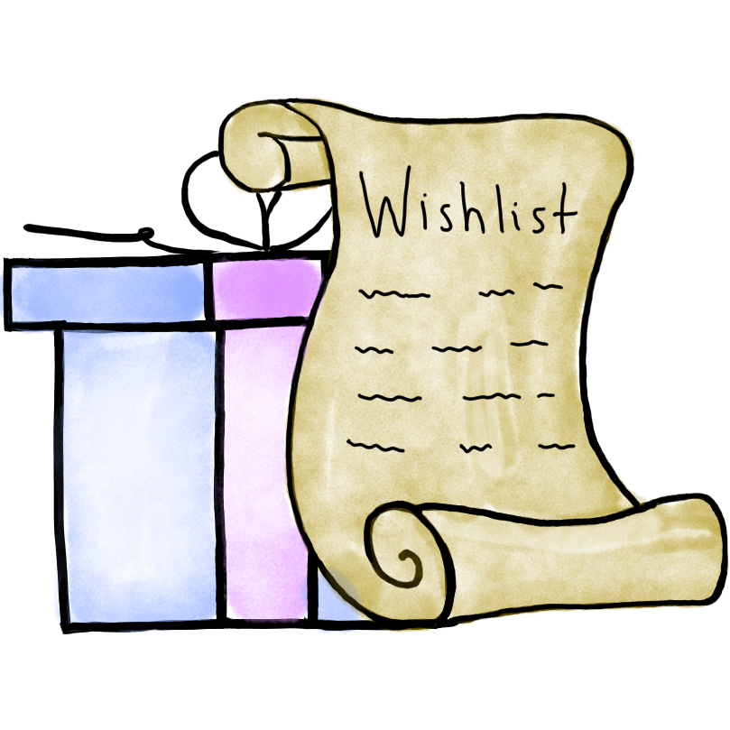
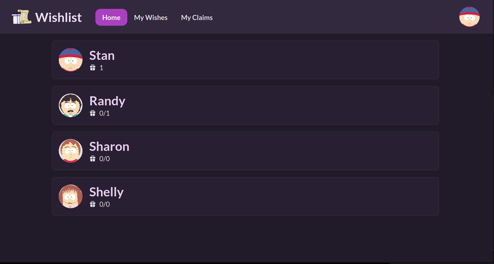
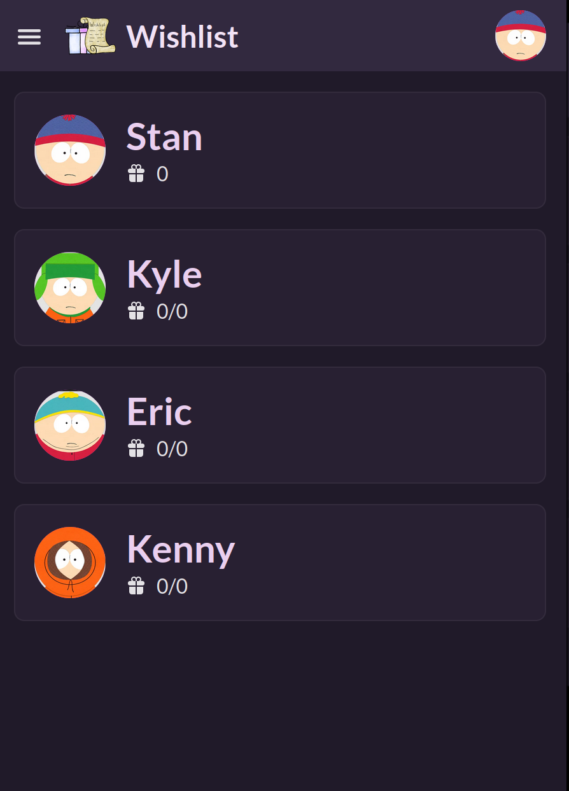
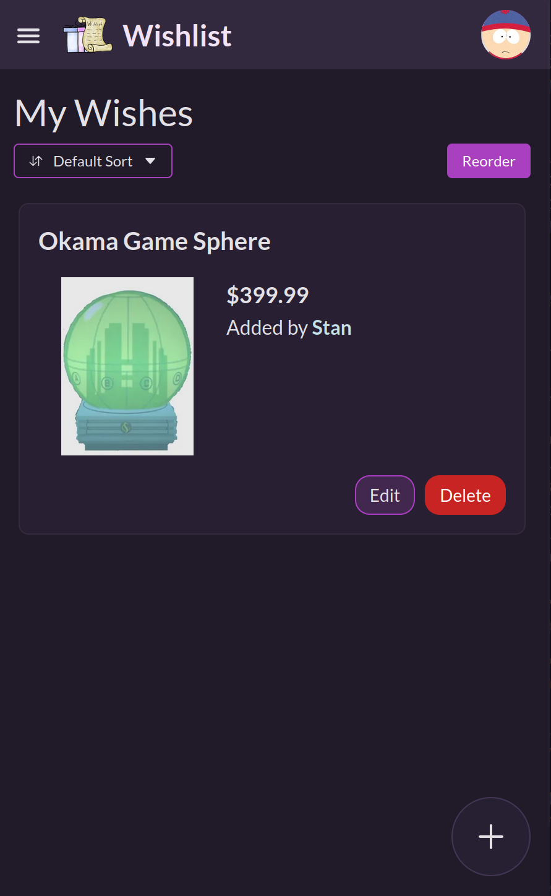
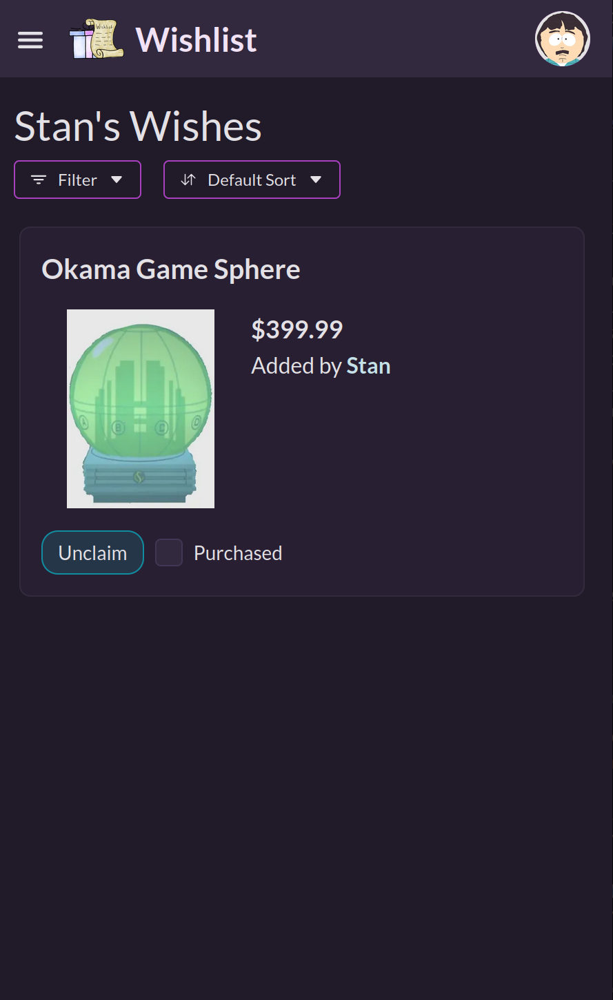
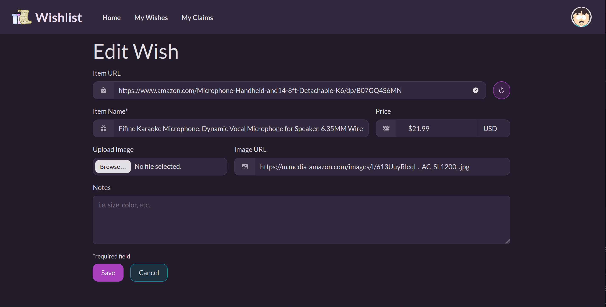

<div align="center">

<h1>Wishlist</h1>
<p> A sharable wishlist for your friends and family </p>
</div>

## About

Wishlist is a self-hosted wishlist application that you can share with your friends and family. You no longer have to wonder what to get your parents for the holidays, simply check their wishlist and claim any available item. With a simple user interface, even the grandparents can get involved!

## Features

-   [x] Claim items on a wishlist
-   [x] Check off claimed items as purchased
-   [x] Automatically fetch product data from URL
-   [x] Invite users via email (SMTP configuration required)
-   [x] Options for [suggestions](#suggestions)
-   [x] PWA Support
-   [x] Multiple groups
-   [x] Registry Mode (single list)

<p float="left">
    
    
    Multiple groups for friends and family
</p>

<p float="left">
    
    
    Add items to your list so other's can claim them
</p>


Create a wish from a URL, or manually fill in the details

## Getting Started

Getting started is simple with Docker Compose

Create a `docker-compose.yaml` file:

```compose.yml
services:
  wishlist:
    container_name: wishlist
    image: ghcr.io/cmintey/wishlist:latest
    ports:
      - 3280:3280
    volumes:
      - ./uploads:/usr/src/app/uploads  # This is where user image uploads will be stored
      - ./data:/usr/src/app/data        # This is where the sqlite database will be stored
    environment:
      # ORIGIN: https://wishlist.example.com
      ORIGIN: http://192.168.2.10:3280 # The URL your users will be connecting to
      TOKEN_TIME: 72 # hours until signup and password reset tokens expire
```

Then simply run `docker compose up -d`.

You can now connect to your application at `http://<host>:3280`.

> **Note**
>
> Set the `ORIGIN` environment variable to the url you will be connecting to, otherwise you will experience issues

### Environment Variables

`ORIGIN`: The URL your users will connect to e.g. `https://wishlist.domain.com`, `http://192.168.2.10:3280`. **Note**, if this value is an IP address, then it must include the exposed port of the application

`TOKEN_TIME`: The amount of time (hours) that signup and password reset tokens are valid for

`DEFAULT_CURRENCY`: The global default currency to be used. Currency can still be changed on a per-item basis

### Running behind a reverse proxy

It is recommended to run Wishlist behind a reverse proxy. Currently, Wishlist does not support running on a different subpath (i.e. `https://domain.com/wishlist`).

#### Nginx

There is a [known issue](https://github.com/cmintey/wishlist/issues/170) when running behind Nginx. It is recommended to set the following properties in your Nginx configuration:
```
proxy_buffer_size   128k;
proxy_buffers   4 256k;
proxy_busy_buffers_size   256k;
```

## Groups

Wishlist has support for multiple wishlist groups. For example, you can have one group for friends and one for family. The wishes on these lists will be completely separate. You can switch between groups using the menu when you click on your profile picture.

Currently, anyone can create a group. The group creator is automatically added as a "manager" of the group. A Group Manager can invite users to Wishlist and add/remove existing users to the group they manage. The Group Manager can also delete the group. An Admin will have the same permissions as the Group Manager.

## Registry Mode

Wishlist has the ability to turn a group into a Registry. In this mode, only a single user can be part of the group and there is only one list. The owner of the group can add items to the list as normal and then get a public link to share out to friends and family. Users accessing this link will not need to sign in or create an account. Public users can view the items on the list and also claim items. In order to claim an item, the user just needs to enter some identifier (email for example) and can optionally add their name. Currently there is no way to un-claim items that are claimed in this manner.

To activate this mode, go to the admin panel of your group and change the mode from "Wishlist" to "Registry".

## Configuration

There are several configuration options in the admin panel.

### Public Signup

By default, anyone with the url can signup for an account. You can turn this off and have it be invite only.

If you have [SMTP enabled](#smtp), then you can enter a user's email and an invite link will be sent there. Otherwise, an invite link will be generated for you to copy and send to the user manually.

### Suggestions

Suggestions are enabled by default. With suggestions enabled, you will be able to add items to another person's wishlist. There are a few different suggestion methods.

#### ▶ Approval Required

In this mode, the suggested item will need to be approved by the suggestee in order for it to show up on their wishlist. If the item is approved, it can be edited and deleted by the suggestee at any time.

#### ▶ Auto Approval

In this mode, the suggested item will be automatically approved and added to the wishlist. Similar to the previous method, the item can be edited and delted by the suggestee at any time.

#### ▶ Suprise Me

In this mode, the suggested item is automatically approved and added to the wishlist. **However**, the item only shows for everyone except for the suggestee. The suggestee cannot see and therefore cannot edit or delete the item once it has been added.

### SMTP

SMTP does not need to be configured for the app to function. SMTP enables inviting users via email and the forgot password flow. Without SMTP, you can still manually generate invite links and forgot password links.
